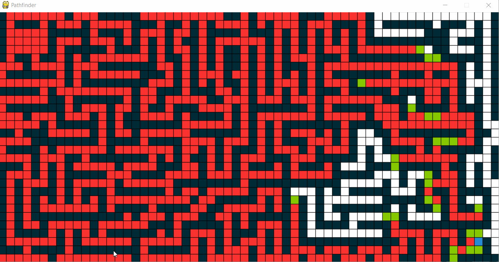

# Pathfinding-Algorithm
A visual implementation of the A* Pathfinding algorithm in pygame, with interactivity

Features:
----
1. A* Pathfinding implementation
2. Left click to place/remove barriers, Right click to move starting location
3. Pauseable with spacebar
4. Capable of rerouting on-the-fly in response to user input
5. Traceback feature

Note: The traceback feature isn't perfect when the algorithm is forced to reroute mid-execution

Gallery:
---
|*Simple example*|*Drawing functionality*|*On-the-fly readjustment*|
|:--:|:---:|:---:|
||||

|*Worst Case Example:*|*Large Scale Traceback Example*
|:---:|:---:
||

How to use:
----
To play with this, clone the repo and run "driver.py".
Press space to pause/unpause the algorithm.
Leftclick places/removes walls, and can be done at any time. Right click moves the starting location to the chosen square.

Notes
----
The main driver function, ```driver.py``` handles all the animation and contains the core loop/actual algorithm. The algorithm itsself is completely generalised to an abritrary number of dimensions, depending only on the ```Cell``` objects definition of "neighbourhood", but the visualiser program is 2D only.
